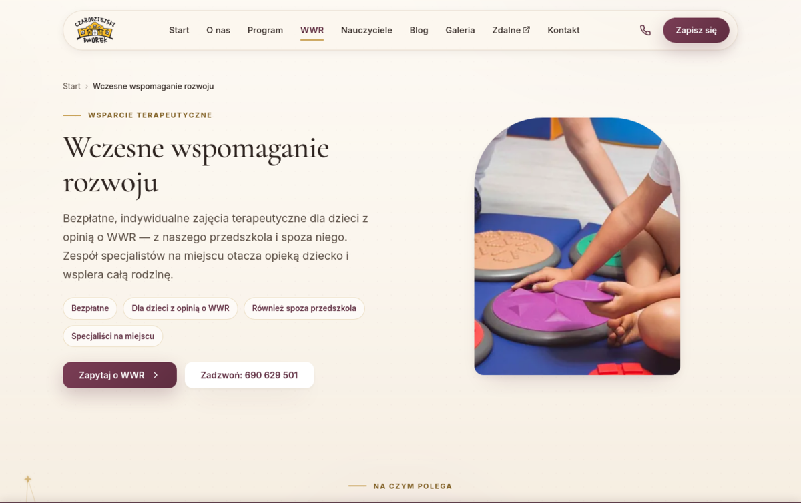
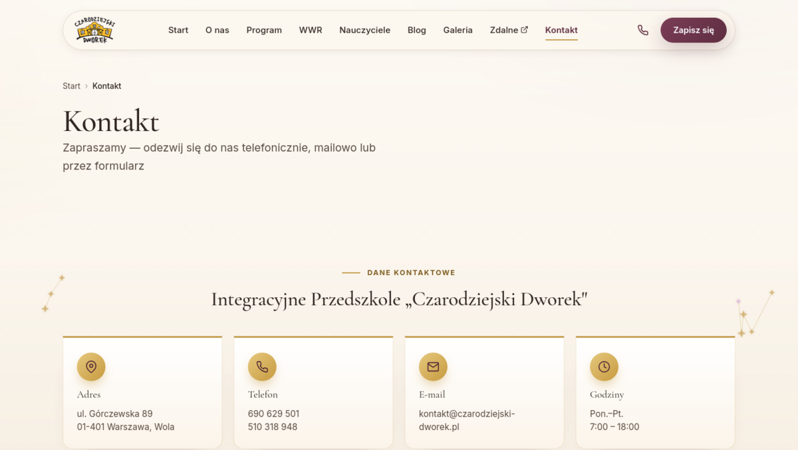
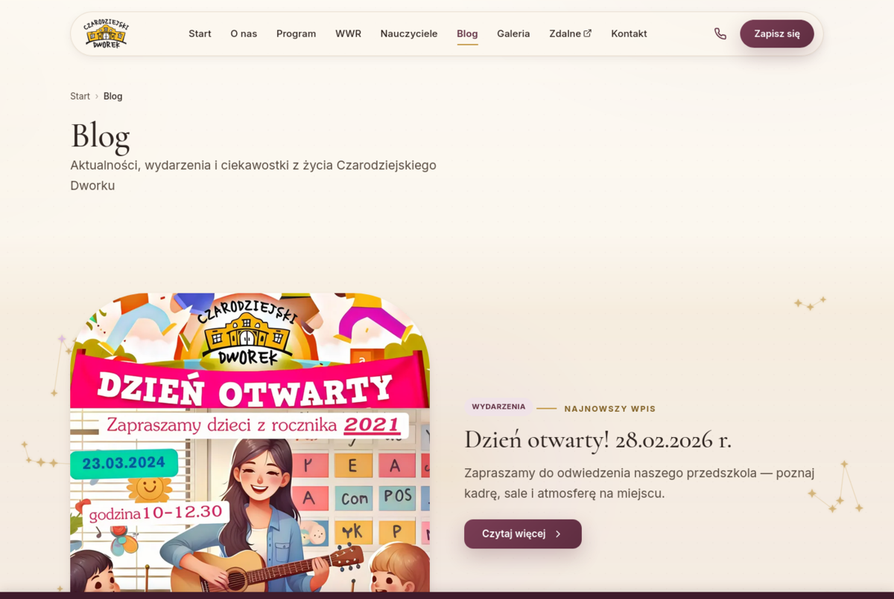

<div align="center">

# Czarodziejski Dworek

**Strona WWW integracyjnego przedszkola niepublicznego** (Warszawa, Wola)
w dwóch zsynchronizowanych wersjach: statyczny HTML na GitHub Pages
oraz **autorski motyw WordPress bez ani jednej wtyczki**. Identyczny wygląd
i treść — różni je tylko technologia.

[▶ Zobacz stronę na żywo](https://krzysiek2115op.github.io/czarodziejski-dworek/) ·
[Motyw WordPress](wordpress-theme/) ·
[Zrzuty](docs/zrzuty/) ·
[Licencja GPL-2.0+](LICENSE)

<br>

[](https://krzysiek2115op.github.io/czarodziejski-dworek/)

</div>

---

<details>
<summary><b>Spis treści</b></summary>

- [Stan projektu](#stan-projektu)
- [Dwie wersje tej samej strony](#dwie-wersje-tej-samej-strony)
- [Motyw WordPress bez wtyczek](#motyw-wordpress-bez-wtyczek)
- [Jak to wygląda](#jak-to-wygląda)
- [Dwa adresy, jeden kanoniczny](#dwa-adresy-jeden-kanoniczny)
- [Uruchomienie](#uruchomienie)
- [Licencja i prawa do treści](#licencja-i-prawa-do-treści)

</details>

## Stan projektu

| | |
|---|---|
| **Klient** | Integracyjne Przedszkole „Czarodziejski Dworek", ul. Górczewska 89, Warszawa (Wola) |
| **Etap** | Wdrożone. Strona statyczna działa na GitHub Pages, motyw gotowy do wgrania |
| **Rozmiar** | **13 podstron HTML** (3 003 linie) · motyw: **2 982 linie PHP w 18 plikach** · 2 117 linii CSS · 758 linii JS |
| **Zasoby** | 75 plików graficznych klienta (13 MB razem z motywem) |
| **Wersja motywu** | 1.0.0 — `wordpress-theme/style.css` |
| **Live** | [https://krzysiek2115op.github.io/czarodziejski-dworek/](https://krzysiek2115op.github.io/czarodziejski-dworek/) |
| **Licencja** | GPL-2.0-or-later dla **kodu**; treści i zdjęcia klienta **poza licencją** — patrz niżej |

<sub>Liczby zmierzone: `cat *.html | wc -l`,
`find wordpress-theme -name '*.php' | xargs cat | wc -l`, `du -sh`.</sub>

## Dwie wersje tej samej strony

```
.
├─ index.html + 12 podstron   wersja statyczna — GitHub Pages, zero zależności
├─ assets/                    css, js, img, icons, docs, fonts
├─ favicon.ico, robots.txt, sitemap.xml, og-image.jpg
└─ wordpress-theme/           autorski motyw WordPress — zero wtyczek
```

**Po co dwie.** Klient dostał najpierw wersję statyczną — szybką, bezawaryjną
i bezkosztową w utrzymaniu. Motyw WordPress powstał, kiedy okazało się, że
przedszkole chce samo dopisywać wpisy na blogu i zdjęcia do galerii. Wersja
statyczna zostaje jako punkt odniesienia: to ona definiuje, jak strona ma wyglądać.

**Obie wersje utrzymuje się równolegle — zmiana idzie do obu.**

## Motyw WordPress bez wtyczek

Zero wtyczek to decyzja, nie przeoczenie. Każda wtyczka w przedszkolu, które nie
ma administratora, to jedna rzecz więcej do zaktualizowania i jedna więcej, która
może się zepsuć bez czyjejkolwiek wiedzy.

Zamiast wtyczek:

| Potrzeba | Rozwiązanie w motywie |
|---|---|
| Blog, galeria, kadra | **Własne typy treści** (`inc/`), edytowalne natywnie |
| Edycja sekcji strony głównej | **Natywny Customizer**, bez page buildera |
| Trzy formularze kontaktowe | **Web3Forms** — mail bez bazy i bez wtyczki |
| SEO | Dane strukturalne schema.org i Open Graph wpisane w szablony |

### Formularze — jedna rzecz do zrobienia po instalacji

Formularze (Kontakt, „Oddzwonimy", WWR) wysyłają zgłoszenia mailem przez darmowy
**Web3Forms**. Wymaga to jednorazowego wklejenia klucza:

1. Wygeneruj klucz na <https://web3forms.com> (podajesz adres, na który mają
   przychodzić zgłoszenia).
2. W panelu: **Wygląd → Dostosuj → Formularze kontaktowe** → pole
   „Klucz Web3Forms (Access Key)" → **Opublikuj**.

> Klucz **nie jest** zapisany w kodzie — wkleja go właściciel strony w panelu.
> To dlatego repozytorium może być publiczne.

## Jak to wygląda

| | |
|---|---|
| [](docs/zrzuty/02-kontakt.png) | **Kontakt** — układ kart z danymi teleadresowymi |
| [](docs/zrzuty/03-blog.png) | **Blog** — jeden z trzech własnych typów treści; filtry kategorii bez ani jednej wtyczki |

Które zrzuty wolno użyć, a których nie i dlaczego —
[`docs/zrzuty/README.md`](docs/zrzuty/README.md).

## Dwa adresy, jeden kanoniczny

Strona żyje pod domeną klienta: <https://www.czarodziejski-dworek.pl>.
Kopia na GitHub Pages jest **demonstracją portfolio**, nie drugą witryną — dlatego
`sitemap.xml` i wszystkie `canonical` wskazują na domenę klienta, a nie na
`github.io`. Bez tego dwie identyczne strony konkurowałyby ze sobą w wynikach
wyszukiwania, a przegrać mogłaby ta właściwa.

## Uruchomienie

**Wersja statyczna** — nie wymaga niczego:

```bash
python3 -m http.server 8080   # → http://localhost:8080
```

**Motyw WordPress** — spakuj zawartość `wordpress-theme/` do ZIP-a, potem
**Wygląd → Motywy → Dodaj nowy → Wyślij motyw** → wgraj → **Aktywuj**.
Przez FTP: skopiuj katalog do `wp-content/themes/` i aktywuj.

## Technologia

HTML5, CSS3, vanilla JavaScript — **bez frameworków i bez kroku budowania**.
Mobile-first, dostępność (WCAG), dane strukturalne schema.org, meta Open Graph.
Motyw: PHP, natywny Customizer, własne typy treści, zero wtyczek.

## Licencja i prawa do treści

**Kod** — motyw WordPress, szablony, arkusze stylów i skrypty — jest na licencji
**GNU GPL v2 lub późniejszej** ([LICENSE](LICENSE)), zgodnie z deklaracją
w `wordpress-theme/style.css` i wymogiem licencyjnym samego WordPressa.

**Poza licencją zostają — i nie wolno ich używać bez zgody klienta:**

- zdjęcia w `assets/img/` (w tym wizerunki dzieci i pracowników),
- teksty i dokumenty w `assets/docs/`,
- logo, nazwa i identyfikacja wizualna przedszkola,
- dane teleadresowe.

To materiały klienta, powierzone do wykonania strony. Licencja GPL obejmuje kod,
którym je wyświetlam — nie je same.
